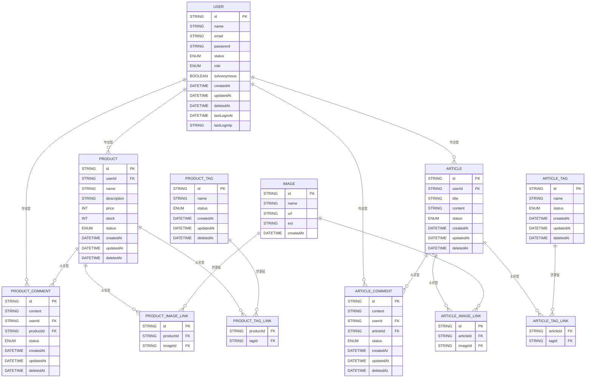
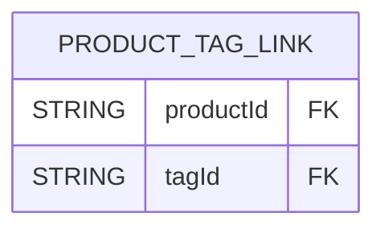

## SPRINT3
### ER DIAGRAM


### 공통
- [x] PostgreSQL를 이용해 주세요.
- [x] 데이터 모델 간의 관계를 고려하여 onDelete를 설정해 주세요.
- [x] 데이터베이스 시딩 코드를 작성해 주세요.
- [x] 각 API에 적절한 에러 처리를 해 주세요.
- [x] 각 API 응답에 적절한 상태 코드를 리턴하도록 해 주세요.

#### 중고마켓
- [x] Product 스키마를 작성해 주세요.
  - [x] id, name, description, price, tags, createdAt, updatedAt필드를 가집니다.
  - [x] 필요한 필드가 있다면 자유롭게 추가해 주세요.
- [x] 상품 등록 API를 만들어 주세요.
  - [x] name, description, price, tags를 입력하여 상품을 등록합니다.
- [x] 상품 상세 조회 API를 만들어 주세요.
  - [x] id, name, description, price, tags, createdAt를 조회합니다.
- [x] 상품 수정 API를 만들어 주세요.
  - [x] PATCH 메서드를 사용해 주세요.
- [x] 상품 삭제 API를 만들어 주세요.
- [x] 상품 목록 조회 API를 만들어 주세요.
  - [x] id, name, price, createdAt를 조회합니다.
  - [x] offset 방식의 페이지네이션 기능을 포함해 주세요.
  - [x] 최신순(recent)으로 정렬할 수 있습니다.
  - [x] name, description에 포함된 단어로 검색할 수 있습니다.
- [x] 각 API에 적절한 에러 처리를 해 주세요.
- [x] 각 API 응답에 적절한 상태 코드를 리턴하도록 해 주세요.

#### 자유게시판
- [x] Article 스키마를 작성해 주세요.
  - [x] id, title, content, createdAt, updatedAt 필드를 가집니다.
- [x] 게시글 등록 API를 만들어 주세요.
  - [x] title, content를 입력해 게시글을 등록합니다.
- [x] 게시글 상세 조회 API를 만들어 주세요.
  - [x] id, title, content, createdAt를 조회합니다.
- [x] 게시글 수정 API를 만들어 주세요.
- [x] 게시글 삭제 API를 만들어 주세요.
- [x] 게시글 목록 조회 API를 만들어 주세요.
  - [x] id, title, content, createdAt를 조회합니다.
  - [x] offset 방식의 페이지네이션 기능을 포함해 주세요.
  - [x] 최신순(recent)으로 정렬할 수 있습니다.
  - [x] title, content에 포함된 단어로 검색할 수 있습니다.

#### 댓글
- [x] 댓글 등록 API를 만들어 주세요.
  - [x] content를 입력하여 댓글을 등록합니다.
  - [x] 중고마켓, 자유게시판 댓글 등록 API를 따로 만들어 주세요.
- [x] 댓글 수정 API를 만들어 주세요.
  - [x] PATCH 메서드를 사용해 주세요.
- [x] 댓글 삭제 API를 만들어 주세요.
- [x] 댓글 목록 조회 API를 만들어 주세요.
  - [x] id, content, createdAt 를 조회합니다.
  - [x] cursor 방식의 페이지네이션 기능을 포함해 주세요.
  - [x] 중고마켓, 자유게시판 댓글 목록 조회 API를 따로 만들어 주세요.
#### 유효성 검증
- [x] 상품 등록 시 필요한 필드(이름, 설명, 가격 등)의 유효성을 검증하는 미들웨어를 구현합니다.
- [x] 게시물 등록 시 필요한 필드(제목, 내용 등)의 유효성 검증하는 미들웨어를 구현합니다.
- [x] multer 미들웨어를 사용하여 이미지 업로드 API를 구현해주세요.
  - [x] 업로드된 이미지는 서버에 저장하고, 해당 이미지의 경로를 response 객체에 포함해 반환합니다.
#### 이미지 업로드
- [x] multer 미들웨어를 사용하여 이미지 업로드 API를 구현해주세요.
  - [x] 업로드된 이미지는 서버에 저장하고, 해당 이미지의 경로를 response 객체에 포함해 반환합니다.
#### 에러 처리
- [x] 모든 예외 상황을 처리할 수 있는 에러 핸들러 미들웨어를 구현합니다.
- [x] 서버 오류(500), 사용자 입력 오류(400 시리즈), 리소스 찾을 수 없음(404) 등 상황에 맞는 상태값을 반환합니다.
#### 라우트 중복 제거
- [x] 중복되는 라우트 경로(예: /users에 대한 get 및 post 요청)를 app.route()로 통합해 중복을 제거합니다.
- [x] express.Router()를 활용하여 중고마켓/자유게시판 관련 라우트를 별도의 모듈로 구분합니다.
#### 배포
- [x] .env 파일에 환경 변수를 설정해 주세요.
- [x] CORS를 설정해 주세요.
- [ ] render.com으로 배포해 주세요.

### 스크린샷


### 멘토에게
#### ER Diagram
데이터베이스 기초 수업 중에 강사님이 Mermaid 라는 툴을 사용하는 것을 보고 바로 연습삼아 사용했습니다.

모델 마다 관계성이 낮았을 때는 간단한 구조였는데, User 가 추가되니까 약간 얼기설기 얽힌게 조금씩 복잡한 형태가 되었습니다. 

이 정도 프로젝트도 이런데, 실무 프로젝트는 얼마나 더 복잡한 형태일지 상상도 안 됩니다.

#### Image, Tag 시행착오
Tag 를 ProdcutTag 와 ArticleTag 로 나눠서 생성했습니다. 

이는 제품을 등록할 때 사용할 Tag 와 자유게시판에서의 Tag 가 겹칠 일이 없다는 생각이 들었기 때문입니다. 그리고 TAG 를 하나로 관리하면 나중에 findMany 할 때, 또 where 로 이게 Product 용인지 Article 용인지 구분해야 하는게 귀찮았습니다..

Image 도 처음에는 이렇게 만들었다가, Image 는 한번 올리고 나면 Product 나 Article 에서도 사용할 수 있다는 것을 깨닫고 다대다 구조로 변경했습니다.

그러면서 Link 와 onDelete:Cascade 를 적용해서, Image 가 삭제되면 Product 나 Article 에서 Link를 없애서 등록된 images 에서 빠지게 했습니다.

반대로 Product 나 Article 이 사라져도 해당 Image 는 영향을 받지 않습니다.

근데 생각해보면 Tag 랑 ProductTag 같은 애도 다대다 인데 왜 동작하지? 싶어서 찾아보니 Prisma 가 자동으로 Link 를 만든다는 것을 알게 되었습니다.



Image 는 완전 다른? Product, Article 두 모델에서 관계성을 가져서 제가 따로 Link 를 만들어야 했던 거라고 이해했습니다.

Prisma.. 정말 편한 ORM 이었습니다. 너무 편해서 Link 를 모르고 넘어갈 뻔 했을지도..

#### User 스키마 추가
처음에는 Product 와 Article, ProductComment, ArticleComment 에 password 를 넣는 방식으로 작업했었습니다. 

그러다가 보안이나 안전성에 대해서도 고민해보는 백엔드 개발자가 되면 좋겠다라고 하셨던게 기억이 났습니다.

"그래! 로그인 한 사용자만 수정할 수 있음 더 보안이 좋잖아!"

그래서 시간도 남았겠다 User 모델을 추가했습니다.(그리고 또 다시 가시밭길을..)

단순히 User 를 추가해서 로그인 해서 토큰은 받는 건 bcrypt, jwt 패키지를 사용하니 간단하게 해결되었습니다.

뭔가 만들어지는 느낌이 들어서 "이렇게 된거 Role 에 따라서 되는 거 안 되는거 구분해보자!" 하고 또 신나서 달렸더니 프로젝트가 과하게 커졌습니다.

힘들긴 했는데, 그래도 재밌었습니다. 

권한 체크를 어떻게 하면 좋을까~ 고민하다가, 배운게 아직 기초 부분 뿐이라 단순무식하게 Role 을 받아와서 체크했습니다.

미들웨어로 감싸서 next 로 보내는 것 덕분에, routes 코드에서 깔끔하게 작성되니까 기분이 좋았습니다. :\)

#### WWW(API 테스터)
수업 시간에 주강사님이 이미지 업로드를 위해서 작성했던 간단한 코드를 기반으로 조금(?) 더 수정했습니다.

처음에는 axios 기반의 간단한 테스트 프로그램을 만들어서 API 테스트를 진행했습니다. 그런데 User 가 들어가고 나니까 감당이 안되서, 그냥 API 테스트 하는 웹페이지를 만들어서 테스트했습니다.

css 는 그냥 chatGPT 한테 만들어 달라고해서 가져다 썼습니다. 한번 꾸미기 시작하면 또 신나서 끝없이 달려들까봐 절제했습니다..ㅠㅠ

axios 를 사용할 때 node.js 에서 쓰던 것처럼 import 를 했더니 에러가 발생했었습니다.

알아보니 번들링을 통해서 가져와야 한다고 해서..

```html
<script src="https://cdn.jsdelivr.net/npm/axios/dist/axios.min.js"></script>
````

그냥 \<head\> 에 CDN 을 추가하는 것으로 해결했습니다.

지금 당장은 단일 API TEST 페이지만 보이면 되고, 단순히 axios 가 동작만 하면 되서 저게 더 빠른 해결법이었습니다.

#### 오타 최소화하기
오타를 어떻게 해야 최소화할지 고민을 많이 했습니다.

꼼꼼히 API 테스트를 하고 꼼꼼히 코드를 살펴보는 건 당연할테고, 그 밖에도 미리 예방할 방법이 없을까 고민하다가..

그냥 COMMON 에 자주 사용되는 값 또는 기본값 들을 상수로 만들어두고 그걸 가져와서 사용하는 방법으로 진행했습니다.

그러면 적어도 제가 직접 하드 코딩해서 값을 넣는 경우?는 없으니까 오타가 최소화 되지 않을까.. 했는데 그래도 오타가 많이 발생했어서 놀랬습니다..

키보드의 키가 씹히는 건지, 이제 이 부분은 쉽지! 하고 후루룩 작성하고 넘어갔던 코드들이 대체로 알파벳 순서가 잘못된 경우가 많아서 조심하고 있습니다.

API 테스트 페이지를 만들면서 테스트에 집중했던 것도 API 테스트로 오타를 찾아내기 위함이었지 않나..라고 생각합니다.