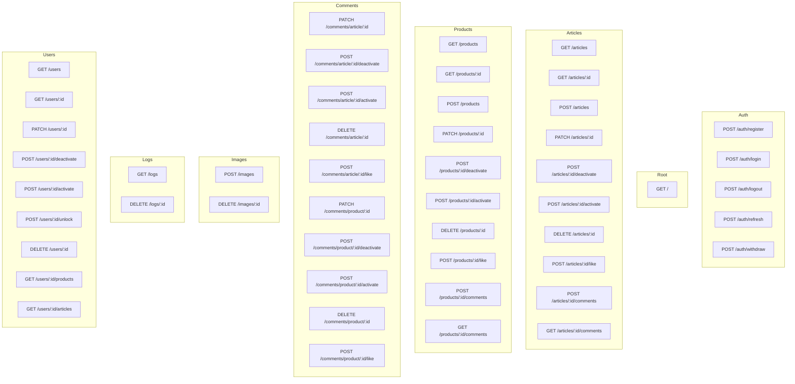
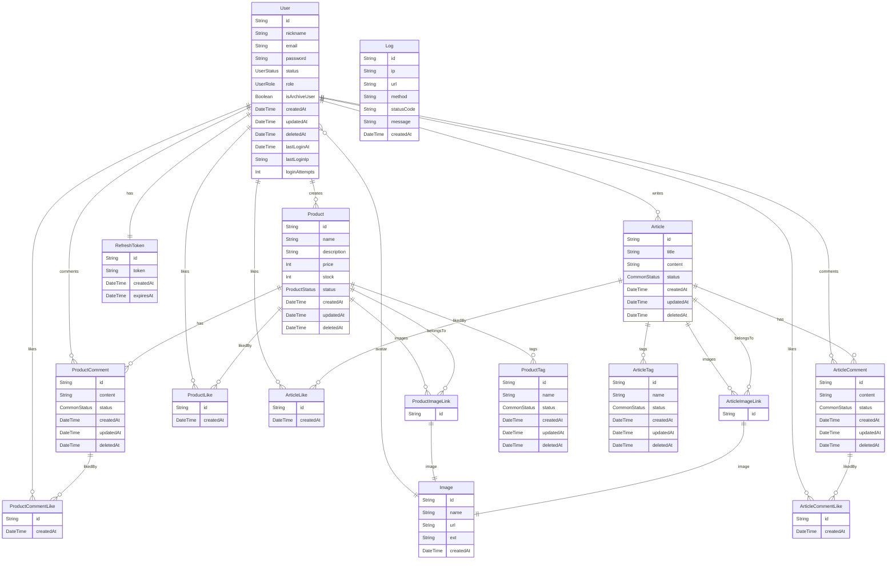

# 변경점

## 추가된 스프린트 4 의 요구사항

그밖의 요구사항은 스프린트3 에서 이미 구현했었던 기능이었습니다.

- [x] User 스키마 `name`\-\> `nickname`

- [x] User 스키마 `image` 추가

- [x] 좋아요 기능
  - [x] 로그인한 유저는 상품에 '좋아요'와 '좋아요 취소'를 할 수 있습니다.
  - [x] 로그인한 유저는 게시글에 '좋아요'와 '좋아요 취소'를 할 수 있습니다.
  - [x] 상품 또는 게시글을 조회할 때, 유저가 '좋아요'를 누른 항목인지 확인할 수 있도록 isLiked와 같은 불린형 필드를 리스폰스 객체에 포함시켜 리스폰스해 주세요.
  - [x] 유저가 '좋아요'를 표시한 상품의 목록을 조회하는 기능을 구현합니다.

## express.js -> hono.js 마이그레이션

스프린트 미션 3 때 학습삼아 유저 기능을 어느정도 구현했기 때문에 미션이 너무 빨리 끝났습니다. 그래서 추가적으로 뭔가 더 학습 해볼 방법이 없는지 고민했습니다.

그러다 문득, API 서버라고 하는 것의 동작하는 원리는 동일 할테니 다른 프레임워크를 써보면서 다시 처음부터 원리를 복습해보면 좋겠다는 생각이 들었습니다.

만약 마이그레이션을 하는 도중 특정 부분에서 막힌 다면, 그것은 제가 이해하고 작성한게 아니라, 그렇게 동작을 하니까 작성했거나, 수업시간에 이렇게 하라고 해서 한 것일 가능성이 높을 것이라 예상했습니다.

먼저 fastify 와 hono 를 비교했습니다.

| 항목              | fastify                            | hono                                   |
| :---------------- | :--------------------------------- | :------------------------------------- |
| 런타임            | node                               | node/deno/bun                          |
| 철학              | plugin 기반 확장성                 | 초경량 micro                           |
| 성능              | 매우 빠름(express보다 2~3배)       | 매우 빠름(fastify 보다 아주 약간 우세) |
| 라우팅            | 고급 기능 포함(스키마 검증, 훅 등) | 단순한 하루팅, express-like            |
| 미들웨어          | 자체 시스템 + express-like         | app.use() 통일, 매우 간단한 체인       |
| 스키마 검증       | 내장 JSON 스키마 검증              | 외부 미들웨어 필요                     |
| 타입스크립트 지원 | 타입스크립트 퍼스트                | 타입스크립트 자동 추론 강력            |
| 커뮤니티          | 크고 안정적                        | 성장 중이나 작음                       |

로컬에서 간단한 헬스체크 하는 정도로는 fastify 와 hono 의 성능적 차이는 체감되지 않았습니다.

그래서 실제 스프린트 미션 실습을 할 수 있는 약 3일 기간 내에서 빠르게 작업하기 위해서 구조적으로 express 에 더 가까운 구조를 가진 hono 를 선택해서 마이그레이션을 진행했습니다.

## 엔드포인트 개선

기본적인 헬스체크 엔드포인트를 구현하고 서버가 정상적으로 동작하는 것을 확인 한 후에, 전체적인 엔드포인트를 종이에 적어가면서 정리했습니다.

### REST 원칙에 따라 상위리소스/하위리소스 구조로 개편

초급 프로젝트를 진행할 때 보았던 API 명세서를 참고해서, 상위리소스/하위리소스 구조로 개편했습니다.

**개선 전**

- 전체 목록 표시만 고려함

**개선 후**

- `/users/:id/products` : `id` 인 `user` 가 가진 `product` 리스트

### 개선된 엔드포인트



## erd 설계 변경

### 모델 분리로 단일 외래키 구성 → 데이터 무결성 확보

- 기존에는 CommentLike 모델 하나에서 productCommentId와 articleCommentId를 nullable 필드로 함께 관리.

- 두 필드 중 하나만 존재해야 하는 구조였지만, 데이터 무결성에 문제가 발생할 가능성 존재함.

- nullable 로 사용해도 위의 문제를 방지하기 위한 코드를 작성해야하니, 그냥 테이블을 새로 만들어서 관리하는 방향으로 수정.

### 수정된 erd



## prisma unique_id

기존에는 findMany 로 userId 와 productId 를 where 로 필터링 하는 방법으로 해당 객체를 검색했습니다.

그러다가 문득 `@@unique` 를 사용했는데, 정작 이걸 사용하고 있지 않다는 것을 깨달았습니다.

```prisma
@@unique([userId, productCommentId])
```

prisma 문서를 참고한 후, 특정 형식으로 `unique key alias` 를 검색할 수 있다는 것을 알게 되었습니다.

```js
const unlikedProduct = await prisma.productLike.delete({
  where: {
    userId_productId: {
      userId,
      productId,
    },
  },
});
return unlikedProduct;
```

기능을 단순히 외워서 사용해놓고 응용하지 못했다 는 것을 체감할 수 있었던 사례입니다.

## superstruct -> joi

스키마 검증 패키지를 joi 로 마이그레이션 해보았습니다.

스키마 검증도 원리적으로는 다를 바가 없어서 금방 작업했습니다.

다만, joi 의 경우에는 email 이나 uuid 같이 자주 쓰이는 스키마 객체가 기본 내장되어 있어서 별도의 패키지를 설치하지 않아도 된다는 점에서 설치해야 하는 패키지 수가 줄어든다는 장점이 좋았습니다.

## 에러 처리 방법 변경

hono 공식 예제 코드를 보는데 생각보다 try-catch 가 없다는 것을 깨달았습니다.

이유가 궁금해서 hono 문서를 뒤적여보다가, hono 에 자동으로 throw 된 error 가 있으면, 동작하는 onError 내장 콜백이 있다는 것을 알 수 있었습니다.

express 에서 기존 작성했던 코드는 가능한 모든 경우의 에러를 잡는 게 좋겠다 생각해서, try-catch 를 모든 controller 와 service 에 넣고 일일이 throw 하고 있었습니다.

hono 로 마이그레이션하면서 "내가 작성한 try-catch 의 대부분은 굳이 필요없는 것일 수도 있다." 라는 가설을 세우고 에러 처리를 두가지 방법으로 나눠서 테스트 엔드포인트를 만들어서 테스트했습니다.

- 공통: 의도적으로 /endpoint/1 을 하면 에러 throw

1. /all

   - controller, service 모두 try-catch 로 감싸고 throw 함

2. /none
   - controller, service 에 try-catch 가 없음

테스트 결과, 2번(/none) 에서도 문제없이 onError 콜백으로 전달되는 것을 확인할 수 있었습니다.

### try-catch 동작 원리 학습

너무 무분별하게 try-catch 를 써왔던게 아닌가 하는 생각이 들어서, try-catch 가 어떻게 동작하는 지 다시 한번 복습했습니다.

```js
const test = async (shouldThrow) => {
  if (shouldThrow) {
    throw new Error('에러 발생');
  }
  return '성공';
};

const main = async () => {
  try {
    const result = await test(true);
    console.log(result);
  } catch (error) {
    console.error(error.message);
  }
};

main();
```

제가 사용하는 대부분의 코드는 await 를 사용해서 sync 처럼 사용했기 때문에 사실 async 코드를 작성했다는 느낌을 많이 못 받았습니다.

그래서 try-catch 에 연관된 에러가 어떤 것들이 있는지 검색해서 setTimeout 예제를 확인 할 수 있었습니다.

```js
try {
  setTimeout(() => {
    throw new Error('에러 발생');
  }, 1000);
} catch (error) {
  console.error('에러', errors.message);
}
```

**실행 흐름 정리**

1. setTimeout 메서드 호출

2. node 런타임에 타이머 등록

3. setTimeout 은 비동기작업 예약만 하고 바로 리턴

4. try 는 아무런 에러도 확인 못하고 끝남

5. 1 초후 콜백으로 throw 되지만, 이미 try-catch 와 무관한 context

6. 에러는 전역 에러처럼 처리

**context**

- 메서드 실행할 때 생기는 임시 작업 공간

**call stack**

- 메서드가 실행되면, 그 호출 context 가 쌓이는 스택을 말함
- 예외는 현재 실행 중인 스택 프레임 안에서만 try-catch 가능

## redis

jwt 로 발급한 토큰은 compare 만 할 뿐, 로그아웃을 해도 유효기간 내라면 정상적으로 사용할 수 있다는 문제가 있었습니다.

이 문제를 해결하기 위해서 로그아웃을 하면 해당 토큰을 차단하는, 블랙리스트 기능을 추가하려고 했습니다.

어떻게 구현을 해야할까 고민한 끝에 크게 두가지 방법이 있었습니다.

1. express API 서버 메모리에 저장

2. 데이터베이스에 저장

1번은 서버를 껐다가 키면 메모리가 다 날라가는 문제가 있었습니다. 또한 주기적으로 만료된 토큰을 지워주지 않으면 메모리가 계속 쌓이기만 하는 문제가 발생 할 수 있었습니다.

2번은 서버를 껐다 키더라도 토큰은 저장되어있지만, 자동 만료가 없어서 동일하게 주기적으로 만료된 토큰은 쿼리로 검색해서 정리해줘야 하는 문제가 있었습니다.

그래서 뭔가 다른 방법이 있을텐데 라는 생각으로 검색을 해보니 redis 라는 것을 발견해서 적용했습니다.

redis 에 대한 개념은 의외로(?) 간단하다고 받아들였습니다.

그냥 `데이터의 수명을 지정하고 자동으로 삭제시킬 수 있는 인메모리 데이터베이스` 정도라고 인식하고 썼습니다.

더 많은 활용방법이 있을텐데, 지금 구현하려고 했던 블랙리스트 의 기능 구현에는 충분한 정보였습니다.

기존 데이터베이스 방식의 속도가 redis 보다 느리다고 하는데, 로컬에서 스프린트 미션을 하는 정도의 테스트 에서는 체감하기 힘든 단점이었습니다. 한번에 엄청난 양의 트래픽이 발생하고 동시다발적으로 API 호출이 있으면 차이가 더 두드러졌을 것 같기는 합니다.
