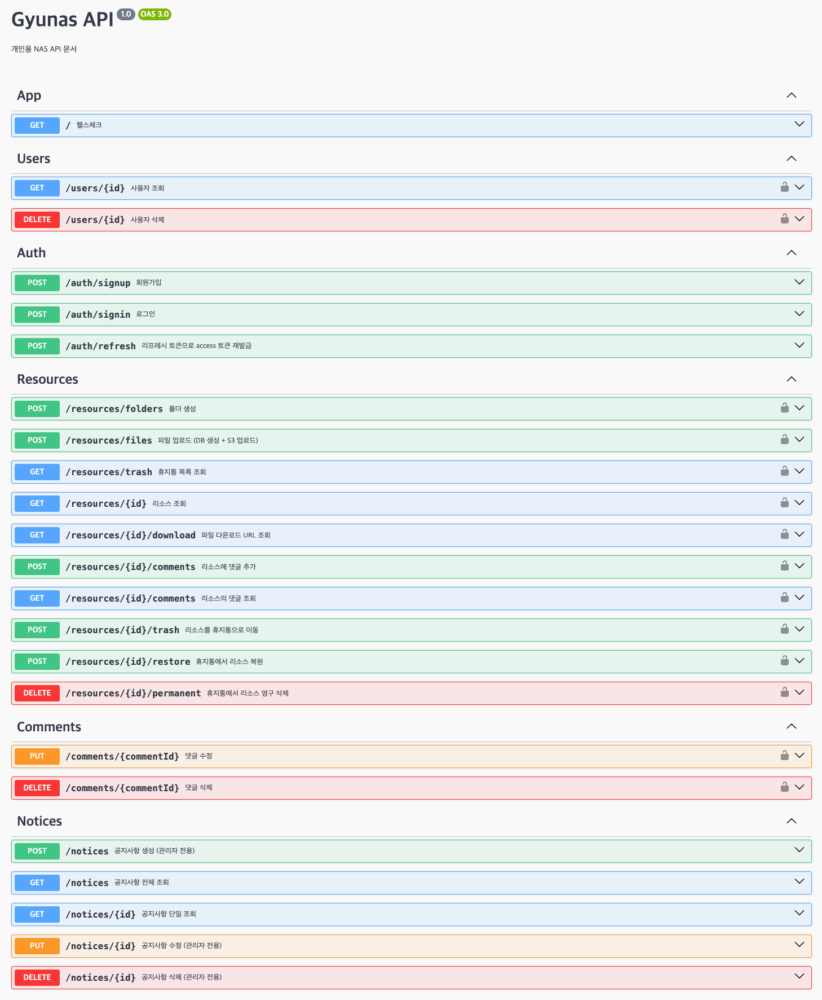

# 스프린트10

판다마켓이 너무 지겨워서 개인 용도로 사용해볼 NAS 를 생각하고 프로젝트를 새로 만들었습니다.

NAS 를 사용해본 적이 없어서 대략적인 기능들만 흉내내면서 만들었지만, 아마존 AWS 를 연습하는 데는 충분했다고 생각합니다.

## 기능 목록

1. 회원가입
2. 로그인
3. 폴더 생성
4. 파일 업로드(Multer, S3)
5. 파일 다운로드(S3)
6. 공지사항(관리자만 추가/수정/삭제 가능)
7. 코멘트 기능(폴더 및 파일에 코멘트 등록, 실시간 웹소켓 알림)

## 엔드포인트

> https://www.gyunas.com/docs

## 미션 목표

- [ ] 판다마켓 서비스를 AWS로 배포하기
- [x] AWS S3 적용
- [x] AWS RDS 적용
- [x] AWS EC2에 Express 서버 배포하기
- [x] (심화) 프로세스 매니저 적용
- [x] (심화) 리버스 프록시 적용

## 시행착오

### 1. Nest.js 사용

**개인적으로 느낀 장점**

1. 규칙이 정해져 있다.  
   하나의 라우트를 작업할 때 생성되는 파일의 수가 많아지는 대신 어느 라우트를 보아도 비슷한 규칙을 따른다. 처음 하나의 라우트를 만들 때는 어색하지만, 하면 할 수록 익숙해져서 유지보수의 면에서 편해졌다고 생각한다.

2. CLI 명령어가 잘 되어 있다.  
   `nest g module example` 과 같이 각각의 코드 기본 값을 만들고 시작할 수 있다.

개인적으로는 express 보다 nest.js 를 먼저 배웠다면 더 편했을 거라는 생각이 들었다.

구조적으로는 복잡하지만, 규칙이 정해져 있다는 점이 개인적으로는 더 학습이 편했다고 느꼈다.

**개인적으로 느낀 단점**

1. 아직 빌드 배포 할 때 발생하는 오류들이 있다.  
   이번 AWS 배포에서는 `crypto` 를 못 찾는 오류가 있었다. 온갖 방법을 다 동원한 끝에 `main.ts` 에서 미리 예외처리하는 방법으로 해결했다.

2. 상대적으로 무겁다.  
   `express.js` 와 비교해서 상대적으로 조금 더 메모리를 먹었다. 그리고 EC2 에서 빌드 할 때 시간을 제법 많이 기다렸다.

### 2. typeORM 사용

nest.js 의 규칙에 따라 엔드포인트 단위로 디렉토리를 나누면서 `*.entity.ts` 로 넣어서 관리하니 조금 예뻐보였다. 엔티티의 구조적으로는 mikroORM 과 큰 차이가 없었고, 몇가지 소소한 기능들이 내장 되어 있었다.

softDelete 를 내부적으로 지원한다는 등의 소소한 기능들이 있었지만, 잘못 사용하면 오히려 꼬이거나 해서 가능한 간단한 기능들만 사용하면서 작업했다.

### 3. 도메인 연결

ec2 에서 `elastic domain` 을 할당해서 nginx 에서 도메인을 연결했다.

이 과정에서 `https` 를 지원하기 위해서 `certbot` 을 사용했는데, 특정 도메인은 자동 갱신이 안 된다는 것을 알게되었다.

원래는 `zip` 도메인을 사용했는데, 특수 도메인이라서 90일마다 수동으로 갱신해줘야 한다고 에러가 떴다.

그래서 그냥 어쩔 수 없이 `com` 으로 다시 연결해서 해결했다.
